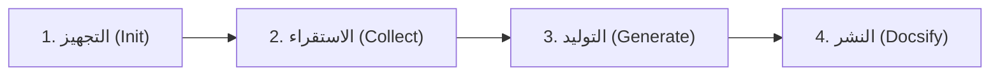

<div align="center">

# 📚 TidyFactor Doc `v1.3.0`
### محرك استقراء الأكواد البرمجية، وتوليد مراجع الـ API، ومنصة النشر المزدوجة (MkDocs Material و Docsify)

**بناء توثيقات فنية دقيقة، مستدامة، آمنة، وقابلة للتصفح لعصر التعاون بين المطورين ووكلاء الذكاء الاصطناعي.**

[](https://www.npmjs.com/package/@alwkala/tidyfactor-doc)
[](LICENSE)
[](https://github.com/TidyFactor/Doc)
[](#-ضمانات-الأمان-وحجب-البيانات-الحساسة)
[](#-معايير-الروابط-النسبية-والتصفح-النظيف)
[](README.md)

[🌐 الموقع الرسمي](https://tidyfactor.com/) • [📚 مركز التوثيق](https://tidyfactor.com/documentation) • [🤝 الشريك (الوكالة)](https://alwkala.com/) • [⚡ سجل الأوامر](#-سجل-الأوامر-ومسارات-التوثيق-الأربعة) • [🛡️ الضمانات الأمنية](#-ضمانات-الأمان-وحجب-البيانات-الحساسة) • [📖 النسخة الإنجليزية (English)](README.md)

<br/><br/>

<p align="center">
  
</p>

</div>

---

> [!NOTE]
> **TidyFactor Doc** هو محرك حتمي لبناء التوثيقات الفنية ومواقع Docsify التفاعلية مخصص لوكلاء البرمجة الذكية (*Google Antigravity, Claude Code, Cursor, Codex, Windsurf*). يقوم باستقراء قواعد الأكواد والمشاريع البرمجية بدقة عبر فحص شجرة التعليمات البرمجية، وتاريخ التعديلات في Git، ومتغيرات بيئة التشغيل، وأنماط معالجة الأخطاء، لينتج مراكز توثيق متكاملة تحت مجلد `/docs` بدون أي تسريب للبيانات الحساسة أو روابط محلية معطوبة.

---

## 🌟 القيمة المضافة ولماذا TidyFactor Doc؟

| للمطورين وقادة الفرق التقنية | لوكلاء البرمجة الذكية (AI Agents) | للمشاريع البرمجية والشركات |
|---|---|---|
| **انعدام الكتابة اليدوية**: استخراج تلقائي لمعمارية المشروع، وتواقيع الـ API، وخطوات التثبيت مباشرة من الكود المصدري. | **توجيه موفر للرموز (Tokens)**: موجه `SKILL.md` ذكي (~350 رمزاً) يحمّل مسار العمل وسياق الذاكرة المطلوب فقط. | **موقع Docsify فوري**: أمر واحد يحول مجلد `/docs` إلى بوابة توثيق ويب تفاعلية سريعة ومزودة بمحرك بحث فوري. |
| **منع تسريب البيانات السرية**: حجب وتنقيح تلقائي لمفاتيح API، وكلمات المرور، وبيانات قواعد البيانات، وعناوين IP. | **الاعتماد على الحقائق فقط**: منع اختلاق أي دوال أو معلمات غير موجودة؛ كل حقيقة موثقة مستندة لنتائج الفحص. | **دعم لغات متعددة (Polyglot)**: قوالب جاهزة لـ PHP 8+، وTypeScript، وJavaScript ES Modules، ومكونات React/Vue/Next. |
| **روابط نسبية نظيفة**: إزالة تامة لروابط `file:///` والمسارات المطلقة (`C:\...`) لضمان عمل التوثيق في أي بيئة. | **تحقق حتمي صارم**: كل مسار عمل يمتلك قائمة تدقيق وتتبع آلي للحالة في `docs/.doc-manifest.json`. | **دعم أصيل للغة العربية**: اتجاه RTL مدمج وتوافق طباعي فاخر (خطوط Cairo وTajawal مع Inter). |

---

## 🔄 دورة حياة التوثيق ذات الـ 4 مراحل

تتبع المهارة مساراً تسلسلياً حتمياً من 4 مراحل:



```
[ المرحلة 1: init ] ───> إنشاء هيكل مجلد /docs وملف التتبع .doc-manifest.json
         │
[ المرحلة 2: collect ] ─> استقراء الأبعاد الـ 5 (الكود، تاريخ Git، بيئة التشغيل، الجمهور، الأخطاء) وحفظها في docs/.collected/
         │
[ المرحلة 3: generate ] ─> إنتاج مراجع API، الأدلة الفنية، التعليقات البرمجية، أو ملف README من الحقائق المستقرأة
         │
[ المرحلة 4: docsify ] ──> تجميع index.html و_sidebar.md للعرض المباشر في المتصفح والاستضافة الثابتة
```

---

## 🏛️ سجل الأوامر ومسارات التوثيق الأربعة

| نية المطور وطلب المستخدم | الأمر | مسارات العمل والذاكرة المحملة | المخرجات الناتجة |
|---|---|---|---|
| **"تجهيز وهيكلة مجلد التوثيق"** / "scaffold /docs" | `init` | `workflows/init-docs.md`<br>`memory/doc-tree.md` | مجلد `/docs`، ملف `docs/.doc-manifest.json`، وصفحة `docs/README.md` |
| **"استقراء وفحص الكود والمشروع"** / "gather facts" | `collect` | `workflows/collect.md`<br>`memory/collection-sources.md` | تقرير `docs/.collected/<target>.md` (تحليل منظم بالأبعاد الخمسة) |
| **"كتابة مرجع واجهة برمجة (API)"** / "API reference" | `generate` | `workflows/generate-api.md`<br>`memory/doc-templates.md`<br>`memory/stacks/*.md` | ملف `docs/api/<target>.md` (جداول المعاملات، القيم المرجعة، الأخطاء) |
| **"كتابة دليل إعداد وتشغيل"** / "setup guide" | `generate` | `workflows/generate-guide.md`<br>`memory/doc-templates.md` | ملف `docs/guides/<purpose-slug>.md` (دليل متخصص محدد الغرض) |
| **"توليد أو تحديث README الرئيسي"** / "generate readme" | `generate` | `workflows/generate-readme.md`<br>`memory/doc-templates.md` | ملف `README.md` في جذر المشروع (نظرة عامة، التثبيت، المتغيرات) |
| **"إضافة تعليقات برمجية للكود"** / "inline docblocks" | `generate` | `workflows/generate-inline.md`<br>`memory/stacks/*.md` | تعديل مباشر للملفات المصدرية بتعليقات PHPDoc / JSDoc / TSDoc |
| **"تحويل التوثيقات إلى موقع Docsify"** / "deploy portal" | `docsify` | `workflows/docsify.md`<br>`memory/docsify-config.md` | ملفات `docs/index.html` و`docs/_sidebar.md` (موقع تفاعلي متكامل) |

---

## 🛡️ ضمانات الأمان وحجب البيانات الحساسة

أثناء تشغيل وكلاء الذكاء الاصطناعي، قد تتسرب مفاتيح سرية أو عناوين خوادم حقيقية إلى ملفات التوثيق العامة. تفرض `tidyfactor-doc` قواعد حجب صارمة وغير قابلة للتجاوز (**القاعدة الإلزامية 6**):

| نوع البيانات الحساسة | المحظور منعه تماماً | البديل الآمن الإلزامي |
|---|---|---|
| **مفاتيح API والرموز السرية** | `sk_live_948f98a7c1b2...` | `EXAMPLE_TOKEN_1234567890ABCDEFGH` أو `YOUR_API_KEY` |
| **كلمات المرور وقواعد البيانات** | `RootP@ssw0rd2026!` | `your_secret_password` |
| **عناوين IP الخاصة بالخوادم** | `192.168.1.50`, `45.33.21.99` | `203.0.113.1` (نطاق RFC 5737 المخصص للتوثيق) |
| **روابط الملفات المحلية** | `file:///C:/path/to/project/...` | `./docs/guides/` أو `project-root/` |
| **روابط بيئة التطوير الداخلية** | `http://localhost:8080/admin` | `https://api.example.com` أو `http://localhost:PORT` |
| **مسارات مجلدات المستخدم** | `/home/developer/workspace/...` | `~/project` أو `/path/to/project` |

---

## 🌐 معايير الروابط النسبية والتصفح النظيف

لضمان عرض التوثيق بشكل سليم على GitHub، وGitLab، وDocsify، وبرامج قراءة الماركداون، تطبق المهارة **القاعدة الإلزامية 7**:

- ❌ **منع المسارات المطلقة لمحطة العمل**: حظر تام لروابط `file:///` أو مسارات محركات الأقراص المحلية (`C:\...` أو `/Users/...`).
- ✅ **روابط نسبية نظيفة**: جميع الروابط الداخلية للمستندات تعتمد على المسارات النسبية القياسية (مثل `[دليل المعمارية](./guides/architecture.md)`).
- ✅ **توجيه مستقر ومستمر للقوائم في Docsify**: تكوين `alias: { '/.*/_sidebar.md': '/_sidebar.md' }` مع شرطة مائلة جذرية `/` لمنع اختفاء القائمة الجانبية أو ظهور أخطاء 404 في المسارات المتداخلة.
- ✅ **صفحات التوثيق العربية داخل المجلد الرئيسي**: حفظ النسخ العربية داخل `/docs` مباشرة (مثل `docs/README.ar.md`) دون الربط بملفات خارجية خارج نطاق `/docs`.

---

## 📁 الهيكل المعياري لمجلد `/docs`

تلتزم جميع المشاريع المدارة بواسطة `tidyfactor-doc` بالهيكل النظيف الخالي من المجلدات الفارغة:

```
project-root/
├── README.md                  # نظرة عامة والبدء السريع للمشروع (الجذر)
└── docs/                      # مجلد التوثيق الموحد
    ├── README.md              # الصفحة الرئيسية لمركز التوثيق
    ├── README.ar.md           # النظرة العامة بالعربية
    ├── index.html             # بوابة Docsify التفاعلية
    ├── _sidebar.md            # شجرة التنقل والقائمة الجانبية المولدة آلياً
    ├── .doc-manifest.json     # ملف تتبع الحالة والمزامنة
    ├── .collected/            # نتائج الاستقراء والفحص الأولي (ملف وسيط)
    │   ├── core.md
    │   └── auth-module.md
    ├── api/                   # مواصفات ومراجع واجهات البرمجة (API)
    │   ├── authentication.md
    │   └── billing.md
    └── guides/                # الأدلة الفنية وأدلة المطورين والمستخدمين
        ├── architecture.md
        ├── developer-setup.md
        └── deployment-runbook.md
```

---

## 🚀 التثبيت والتشغيل السريع

### 1. تثبيت المهارة عبر NPM
لإضافة مهارة `tidyfactor-doc` إلى مشروعك أو سجل الوكلاء لديك:

```bash
npx @alwkala/tidyfactor-doc add-skill
```

### 2. التوافق الشامل مع وكلاء الذكاء الاصطناعي
يمكنك استدعاء المهارة في بيئة التطوير المفضلة لديك:

| الوكيل أو المحرر | مثال الاستدعاء |
|---|---|
| **Google Antigravity** | `/tidyfactor-doc` أو "وثق هذا المشروع وأنشئ موقع Docsify" |
| **Claude Code** | `/tidyfactor-doc init` أو "Generate API docs for src/Core" |
| **Cursor & Windsurf** | `@tidyfactor-doc جهز مجلد التوثيق وافحص مسار الكود` |
| **Codex CLI** | `tidyfactor-doc generate API reference` |

### 3. المعاينة المحلية الفورية
لمعاينة موقع Docsify محلياً في المتصفح:

```bash
# باستخدام خادم PHP المدمج
php -S localhost:3001 -t docs

# أو باستخدام أداة Docsify CLI أو بايثون
npx docsify-cli serve docs
python -m http.server 3001 -d docs
```

---

## 📜 الترخيص وحوكمة المنظومة

- **الترخيص**: مرخصة تحت رخصة **Apache License 2.0**.
- **المنظومة**: تطوير وصيانة [منظومة TidyFactor](https://tidyfactor.com) بالشراكة مع [الوكالة الرقمية Alwkala](https://alwkala.com).
- **الحوكمة**: مبنية وموثقة وفق **منهجية مهارات TidyFactor** (Single Source of Truth، وإصدارات SemVer الموثقة، وفصل التوجيه عن التنفيذ).
