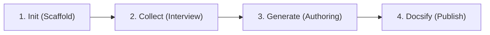

<div align="center">

# 📚 TidyFactor Doc `v1.2.0`
### Automated Codebase Interview, API Generator & Dual-Engine Publishing Platform (MkDocs Material & Docsify)

**Building accurate, maintainable, secure, and browsable documentation for the era of Human-Agent Collaboration.**

[](https://www.npmjs.com/package/@alwkala/tidyfactor-doc)
[](LICENSE)
[](https://github.com/TidyFactor/Doc)
[](#-enterprise-security--sanitization-guarantees)
[](#-clean-relative-links--navigation-standards)
[](README.md)
[](README.ar.md)

[🌐 Official Website](https://tidyfactor.com/) • [📚 Documentation](https://tidyfactor.com/documentation) • [🤝 Partner (Alwkala)](https://alwkala.com/) • [⚡ Commands](#-commands--the-4-phase-documentation-lifecycle) • [🛡️ Security Guarantees](#-enterprise-security--sanitization-guarantees) • [📖 Read in Arabic (بالعربية)](README.ar.md)

</div>

---

> [!NOTE]
> **TidyFactor Doc** is a deterministic documentation engine and Docsify architecture suite built for AI coding agents (*Google Antigravity, Claude Code, Cursor, Codex, Windsurf*). It systematically interviews a codebase—parsing source AST docblocks, Git commit rationale, runtime environment variables, and error patterns—to produce pristine, browsable `/docs` portals with zero manual drift, zero credential leaks, and zero broken local paths.

---

## 🌟 Value Proposition & Why TidyFactor Doc?

| For Developers & Tech Leads | For AI Coding Agents | For Open-Source & Enterprise |
|---|---|---|
| **Zero Manual Writing**: Non-destructive codebase analysis extracts architecture, API signatures, and setup flows directly from source. | **Token-Efficient Routing**: Router `SKILL.md` (~350 tokens) dispatches isolated workflows with exact memory context. | **Instant Docsify Portal**: One command transforms `/docs` into a responsive, searchable documentation website. |
| **Zero Sensitive Leakage**: Enforces automated redaction of API keys, passwords, database credentials, and production IPs. | **Fact-Grounded Only**: Agents are constrained from hallucinating signatures or parameters—everything traces to findings. | **Universal Polyglot**: Native templates for PHP 8+, TypeScript, JavaScript ES Modules, and React/Vue/Next components. |
| **Clean Relative Linking**: Eliminates broken `file:///` and machine paths (`C:\...`), guaranteeing portable markdown. | **Deterministic Validation**: Every workflow has an explicit checklist and manifest tracking in `docs/.doc-manifest.json`. | **Bilingual by Design**: Native LTR/RTL support with curated typography pairings (Inter + Cairo/Tajawal). |

---

## 🔄 The 4-Phase Documentation Lifecycle

`tidyfactor-doc` structures documentation generation into 4 sequential, deterministic phases:



```
[ Phase 1: init ] ──> Creates /docs directory tree & .doc-manifest.json
         │
[ Phase 2: collect ] ─> Gathers 5 dimensions (Code AST, Git History, Env, Personas, Errors) into docs/.collected/
         │
[ Phase 3: generate ] ─> Produces API refs, Guides, Inline comments, or Root README from collected facts
         │
[ Phase 4: docsify ] ─> Assembles index.html & _sidebar.md for instant static browser preview & hosting
```

---

## 🏛️ Commands & Workflows Registry

| Intent & User Request | Command | Loaded Workflow & Memory | Output Artifact |
|---|---|---|---|
| **"Set up docs for this project"** / "scaffold /docs" | `init` | `workflows/init-docs.md`<br>`memory/doc-tree.md` | `/docs` scaffold, `docs/.doc-manifest.json`, `docs/README.md` |
| **"Document this codebase"** / "gather facts for module X" | `collect` | `workflows/collect.md`<br>`memory/collection-sources.md` | `docs/.collected/<target>.md` (5-dimensional structured analysis) |
| **"Write API reference"** / "generate docs for endpoints" | `generate` | `workflows/generate-api.md`<br>`memory/doc-templates.md`<br>`memory/stacks/*.md` | `docs/api/<target>.md` (parameter tables, returns, errors, examples) |
| **"Write setup guide"** / "create architecture runbook" | `generate` | `workflows/generate-guide.md`<br>`memory/doc-templates.md` | `docs/guides/<purpose-slug>.md` (focused, single-purpose guide) |
| **"Generate project README"** / "update root README" | `generate` | `workflows/generate-readme.md`<br>`memory/doc-templates.md` | Root `README.md` (overview, install, env vars, quick start) |
| **"Add inline docblocks"** / "document public functions" | `generate` | `workflows/generate-inline.md`<br>`memory/stacks/*.md` | Direct source code edit with PHPDoc / JSDoc / TSDoc comments |
| **"Turn /docs into Docsify site"** / "deploy doc portal" | `docsify` | `workflows/docsify.md`<br>`memory/docsify-config.md` | `docs/index.html` + `docs/_sidebar.md` (instant web portal) |

---

## 🛡️ Enterprise Security & Sanitization Guarantees

In modern AI agent workflows, sensitive credentials and private configurations frequently leak into documentation. `tidyfactor-doc` implements strict, non-negotiable redaction rules (**Constraint 6**):

| Secret / Sensitive Category | Prohibited Leaks | Mandatory Safe Replacement |
|---|---|---|
| **API Tokens & Secret Keys** | `sk_live_948f98a7c1b2...` | `EXAMPLE_TOKEN_1234567890ABCDEFGH` or `YOUR_API_KEY` |
| **Passwords & DB Credentials** | `RootP@ssw0rd2026!` | `your_secret_password` |
| **Server & Host IPs** | `192.168.1.50`, `45.33.21.99` | `203.0.113.1` (RFC 5737 documentation prefix) |
| **Workstation File URIs** | `file:///C:/wamp64/www/...` | `./docs/guides/` or `project-root/` |
| **Internal Development URLs** | `http://localhost:8080/admin` | `https://api.example.com` or `http://localhost:PORT` |
| **User Home Directories** | `C:\Users\username\...` | `~/project` or `/path/to/project` |

---

## 🌐 Clean Relative Links & Navigation Standards

To guarantee that documentation renders flawlessly on GitHub, GitLab, Docsify, and local markdown viewers, `tidyfactor-doc` enforces **Constraint 7**:

- ❌ **Zero Absolute Drive Paths**: Never output `file:///` URLs or workstation drive letters (`C:\...`, `/Users/...`).
- ✅ **Clean Markdown Relative Links**: All internal document links use standard relative paths (e.g. `[Architecture Guide](./guides/architecture.md)`).
- ✅ **Docsify Persistent Subfolder Routing**: Configures `alias: { '/.*/_sidebar.md': '/_sidebar.md' }` with root-relative leading slashes (`/guides/...`, `/api/...`) to eliminate 404 broken sidebars when navigating deep routes.
- ✅ **Localized Docs Inside Root**: Localized files reside inside `/docs` (e.g. `docs/README.ar.md`), never linking outside the `/docs` boundary.

---

## 📁 Canonical `/docs` Folder Hierarchy

Every project initialized and maintained by `tidyfactor-doc` strictly adheres to the flattened, no-empty-structures hierarchy:

```
project-root/
├── README.md                  # Project overview & quick start (Root)
└── docs/                      # Single documentation root
    ├── README.md              # Doc-site landing page & introduction
    ├── README.ar.md           # Arabic localized overview (optional)
    ├── index.html             # Docsify single-page application entry point
    ├── _sidebar.md            # Auto-generated categorized navigation tree
    ├── .doc-manifest.json     # Machine-readable sync & state manifest
    ├── .collected/            # Raw interview findings (intermediate artifact)
    │   ├── core.md
    │   └── auth-module.md
    ├── api/                   # Public API & endpoint specifications
    │   ├── authentication.md
    │   └── billing.md
    └── guides/                # Targeted developer & user guides
        ├── architecture.md
        ├── developer-setup.md
        └── deployment-runbook.md
```

### `.doc-manifest.json` Schema
```json
{
  "project": "my-saas-platform",
  "stacks": ["php", "ts", "react"],
  "collected": {
    "auth": "2026-08-20T14:30:00Z",
    "core": "2026-08-20T14:32:00Z"
  },
  "generated": {
    "docs/api/auth.md": "2026-08-20T14:35:00Z",
    "docs/guides/developer-setup.md": "2026-08-20T14:36:00Z",
    "README.md": "2026-08-20T14:37:00Z"
  }
}
```

---

## 🚀 Quick Start & Injection

### 1. Inject Skill via NPM
Add `tidyfactor-doc` to your active workspace or global agent registry:

```bash
npx @alwkala/tidyfactor-doc add-skill
```

### 2. Universal Agent Compatibility
Trigger the skill in your preferred AI Coding Assistant:

| Agent / IDE | Invocation Example |
|---|---|
| **Google Antigravity** | `/tidyfactor-doc` or "Document this codebase and build a Docsify site" |
| **Claude Code** | `/tidyfactor-doc init` or "Generate API docs for src/Core" |
| **Cursor & Windsurf** | `@tidyfactor-doc Set up /docs and interview this PHP module` |
| **Codex CLI** | `tidyfactor-doc generate API reference` |

### 3. Local Preview
Preview your Docsify documentation portal in real time:

```bash
# Using PHP built-in server
php -S localhost:3001 -t docs

# Or using Docsify CLI / Python
npx docsify-cli serve docs
python -m http.server 3001 -d docs
```

---

## 📜 License & Ecosystem Governance

- **License**: Distributed under the **Apache License 2.0**.
- **Ecosystem**: Maintained by [TidyFactor](https://tidyfactor.com) in partnership with [Alwkala Digital Agency](https://alwkala.com).
- **Governance**: Built according to **TidyFactor Skill Methodology** (Single Source of Truth, SemVer releases, Dispatcher Discipline, and Zero Undocumented Drift).
